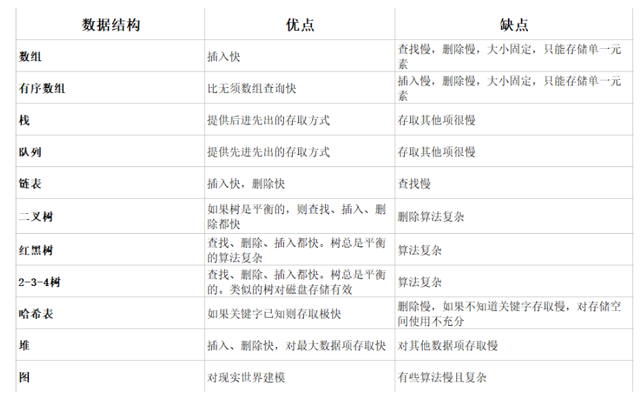

#数据结构
数据结构是计算机存储、组织数据的方式，指相互之间存在一种或多种特定关系的数据元素的集合。通常情况下，精心选择的数据结构可以带来更高的运行或者存储效率。数据结构往往同高效的检索算法和索引技术有关。

## 一、数据结构的基本功能
　　①、如何插入一条新的数据项

　　②、如何寻找某一特定的数据项

　　③、如何删除某一特定的数据项

　　④、如何迭代的访问各个数据项，以便进行显示或其他操作

## 二、常用的数据结构
  
  
  