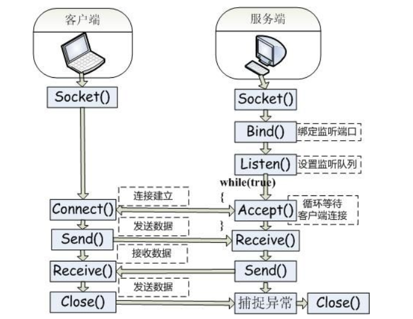
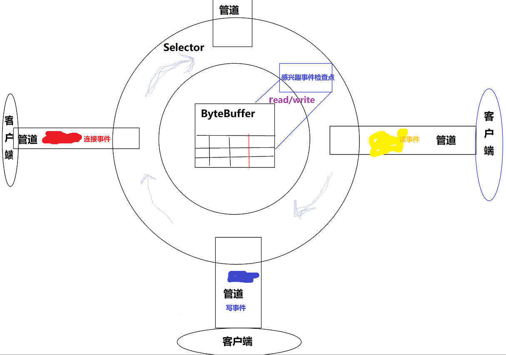

##Java网络编程

### BIO
+ 单客户端请求 
> 字符流读取的结束标识，使用PrintWriter的println()自带换行符，BufferedReader中readLine()自动读取一行
+ 多个客户端请求（多线程）
> 当收到新请求时，创建新线程，一个线程处理一个连接，发起和处理IO请求都是同步的
+ 多客户端请求升级（线程池）
>  使用线程池，减少线程的创建和销毁，复用现有的线程

### NIO 
    同步非阻塞IO，简单理解：一个线程处理多个连接，发起IO请求是非阻塞的但处理IO请求是同步的
+ 缓冲区(Buffer)
    Buffer是一个对象，它包含一些要写入和读取的数据，在面向流的IO中，都是直接写入和读取响应流中的数据。而在NIO库中
    所有数据都是用缓冲区Buffer来实现读写，缓冲区实质是一个数组，该数组为缓冲区提供了读写操作属性。
    ByteBuffer
    CharBuffer
    IntBuffer ...

+ 通道(Channel) 
   像自来水管道一样，网络数据通过Channel进行读写，管道和流不同在于管道是双向的，而流是向一房移动（InputStream,OutputStream）,而管道可以用于读写或者两则同时进行，最关键是可以与多路复用器结合起来，有多种状态位，方便多路复用器识别。通常分为两大类：网络读写通道（SelectableChannel）、文件操作通道（FileChannel）
    SelectableChannel
        -SocketChannel
        -ServerSocketChannel
   
    FileChannel

+ 多路复用器（Selector）
   是NIO的编程基础，它提供选择一家就绪的任务能力。
   简单说Selector会不断轮询注册在上面的Channel，一旦有通道发生了读写操作，这个通道就处于就绪状态，会被Selector轮询出来，然后通过SelectorKey获取到Channel,从而进行后续IO操作。
   一个Selector可以处理成千上万个Channel，没有上限。JDK使用epoll代替传统的select实现，获得连接句柄没有限制。这就意味着使用一个线程轮询就可以出来成千上万个Channel。这是巨大的进步。
   每个Channel注册在Selector上有不同的状态：
    SelectionKey.OP_CONNECT
    SelectionKey.OP_ACCEPT
    SelectionKey.OP_READ
    SelectionKey.OP_WRITE

+ 参考： 
 >  http://ifeve.com/java-nio-all/     
    https://blog.csdn.net/KouLouYiMaSi/article/details/80589083   
    https://blog.csdn.net/u011381576/article/details/79876754
    

### AIO
    异步非阻塞IO，简单理解：一个有效请求一个线程，发起和处理IO请求都是异步的

---

### 对比
|                       | 同步阻塞IO（BIO）| 伪异步IO    | 非阻塞IO（NIO）     |  异步IO（AIO）                     |
| ----------------------|:----------------:| -----------:|:--------------------|------------------------------------|
| 客户端线程:服务端线程 | 1:1              | m:n（m>=n） |  m:1                | m:0（不需要额外启动线程，被动回调）|
| IO类型（同步）        | 同步IO           |  同步IO     | 同步IO（IO多路复用）| 异步IO                             |
| IO类型（阻塞）        | 阻塞IO           |  阻塞IO     | 非阻塞IO            | 非阻塞IO                           |
| API使用难以度         | 简单             |  简单       | 非常复杂            | 复杂                               |
| 调试难度              | 简单             |  简单       | 复杂                | 复杂                               |
| 可靠性                | 非常差           |  差         | 高                  | 高                                 |
| 吞吐量                | 低               |  低         | 高                  | 高                                 |

## 网络编程框架 
 
 ### nttey
 
 ### mima
 
 ### 